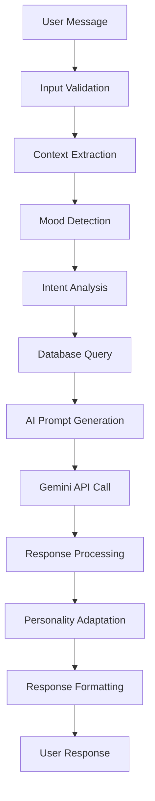
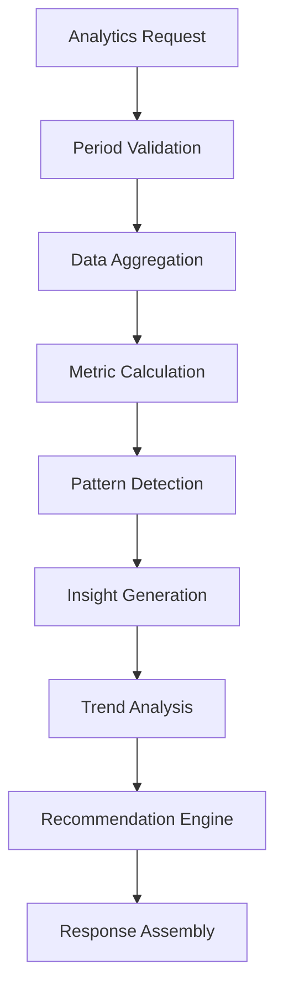

# 🔧 Documentação Técnica - Lumi AI

## 📋 Índice

1. [Arquitetura do Sistema](#-arquitetura-do-sistema)
2. [Especificações dos Módulos](#-especificações-dos-módulos)
3. [Fluxos de Processamento](#-fluxos-de-processamento)
4. [Configuração e Deployment](#-configuração-e-deployment)
5. [Integração com Banco de Dados](#-integração-com-banco-de-dados)
6. [Sistema de Personalidade](#-sistema-de-personalidade)
7. [Analytics e Insights](#-analytics-e-insights)
8. [Tratamento de Erros](#-tratamento-de-erros)

---

## 🏗️ Arquitetura do Sistema

### Visão Geral

A Lumi AI utiliza uma arquitetura em camadas com separação clara de responsabilidades:

```
┌─────────────────────────────────────────────────────────────┐
│                      API Layer (FastAPI)                   │
├─────────────────────────────────────────────────────────────┤
│  Chat Handler    │  Analytics Handler   │  Health Handler  │
├─────────────────────────────────────────────────────────────┤
│                    Services Layer                           │
├─────────────────────────────────────────────────────────────┤
│ User Analytics │ Task Intelligence │ Mood Detector │ Insights│
├─────────────────────────────────────────────────────────────┤
│                     Core Layer                              │
├─────────────────────────────────────────────────────────────┤
│  AI Engine     │ Personality Engine │ Context Analyzer     │
├─────────────────────────────────────────────────────────────┤
│                   Data Layer                                │
├─────────────────────────────────────────────────────────────┤
│    Database Manager    │       Models        │    Config   │
└─────────────────────────────────────────────────────────────┘
```

### Componentes Principais

#### 1. **API Layer** (`/api/`)
- **FastAPI Framework**: Servidor ASGI com validação automática
- **Documentação Automática**: Swagger UI + ReDoc
- **Middleware**: CORS, rate limiting, logging
- **Handlers**: Processamento de requisições REST

#### 2. **Services Layer** (`/services/`)
- **Business Logic**: Regras de negócio específicas
- **Analytics**: Processamento de métricas e insights
- **Intelligence**: Lógica de otimização de tarefas

#### 3. **Core Layer** (`/core/`)
- **AI Engine**: Integração com Gemini AI
- **Personality Engine**: Sistema de personalidade adaptativa
- **Context Analyzer**: Análise de intenções e contexto

#### 4. **Data Layer** (`/config/`, `/models/`)
- **Database Manager**: Conexões async com PostgreSQL
- **Models**: Validação de dados com Pydantic
- **Configuration**: Configurações centralizadas

---

## 🧩 Especificações dos Módulos

### Core Modules

#### `core/ai_engine.py`

```python
class AIEngine:
    """Motor principal de IA usando Google Gemini"""
    
    def __init__(self, api_key: str, model: str = "gemma-2-2b-it"):
        self.client = genai.GenerativeModel(model)
        self.rate_limiter = RateLimiter(max_requests=60)
    
    async def generate_response(
        self, 
        prompt: str, 
        context: Dict,
        personality_state: str
    ) -> AIResponse:
        """Gera resposta contextualizada com personalidade"""
```

**Características:**
- ✅ **Rate Limiting**: 60 requests/minuto
- ✅ **Retry Logic**: 3 tentativas com backoff exponencial
- ✅ **Context Injection**: Inserção automática de contexto
- ✅ **Error Handling**: Tratamento de falhas da API

#### `core/personality_engine.py`

```python
class PersonalityEngine:
    """Sistema de personalidade adaptativa com 6 estados"""
    
    MOOD_STATES = {
        "motivated": MoodConfig(...),
        "struggling": MoodConfig(...),
        "focused": MoodConfig(...),
        "overwhelmed": MoodConfig(...),
        "celebrating": MoodConfig(...),
        "returning": MoodConfig(...)
    }
    
    async def detect_mood(
        self, 
        user_context: UserContext
    ) -> MoodDetectionResult:
        """Detecta humor atual baseado em múltiplos fatores"""
```

**Algoritmo de Detecção:**
1. **Análise Textual**: NLP para sentimentos
2. **Padrões Temporais**: Horários de interação
3. **Produtividade Recente**: Métricas dos últimos dias
4. **Contexto de Tarefas**: Status e complexidade
5. **Histórico**: Padrões comportamentais anteriores

#### `core/database_manager.py`

```python
class DatabaseManager:
    """Gerenciador assíncrono de banco PostgreSQL"""
    
    def __init__(self):
        self.pool: asyncpg.Pool = None
        self.max_connections = 20
        self.min_connections = 5
    
    async def get_user_context(self, user_id: int) -> UserContext:
        """Busca contexto completo do usuário"""
        
    async def execute_analytics_query(
        self, 
        query: str, 
        params: List
    ) -> List[Dict]:
        """Executa queries de analytics otimizadas"""
```

**Pool de Conexões:**
- ✅ **Async/Await**: Totalmente assíncrono
- ✅ **Connection Pooling**: 5-20 conexões ativas
- ✅ **Health Checks**: Verificação automática de saúde
- ✅ **Prepared Statements**: Queries otimizadas

### Service Modules

#### `services/user_analytics.py`

```python
class UserAnalytics:
    """Análise avançada de dados do usuário"""
    
    async def calculate_productivity_score(
        self, 
        user_id: int, 
        period: str = "week"
    ) -> ProductivityMetrics:
        """Calcula score de produtividade baseado em múltiplas métricas"""
        
    async def detect_patterns(
        self, 
        user_id: int
    ) -> BehavioralPatterns:
        """Detecta padrões comportamentais usando ML"""
```

**Métricas Calculadas:**
- 📊 **Productivity Score**: 0.0 - 1.0 baseado em múltiplos fatores
- ⏰ **Peak Hours**: Horários de maior produtividade
- 🎯 **Task Completion Rate**: Taxa de conclusão por período
- 🌊 **Flow States**: Detecção de estados de fluxo
- 📈 **Trend Analysis**: Análise de tendências

#### `services/task_intelligence.py`

```python
class TaskIntelligence:
    """Inteligência para otimização de tarefas"""
    
    async def optimize_task_order(
        self, 
        tasks: List[Task],
        user_context: UserContext
    ) -> List[OptimizedTask]:
        """Otimiza ordem das tarefas baseado em contexto"""
        
    async def estimate_duration(
        self, 
        task: Task,
        user_history: UserHistory
    ) -> DurationEstimate:
        """Estima duração baseado em histórico pessoal"""
```

**Algoritmos de Otimização:**
1. **Energy Matching**: Combina complexidade com energia atual
2. **Deadline Priority**: Prioriza por proximidade de deadline
3. **Context Switching**: Minimiza mudanças de contexto
4. **Flow Optimization**: Mantém estados de fluxo
5. **Personal Patterns**: Adapta aos padrões individuais

#### `services/mood_detector.py`

```python
class MoodDetector:
    """Detector avançado de humor e estado emocional"""
    
    async def analyze_text_sentiment(
        self, 
        text: str
    ) -> SentimentAnalysis:
        """Análise de sentimento em português"""
        
    async def detect_stress_indicators(
        self, 
        user_metrics: UserMetrics
    ) -> StressLevel:
        """Detecta indicadores de estresse"""
```

**Indicadores Monitorados:**
- 😊 **Sentiment Score**: -1.0 (negativo) a +1.0 (positivo)
- ⚡ **Energy Level**: Baseado em padrões de atividade
- 🎯 **Focus Quality**: Duração de sessões sem interrupção
- 😰 **Stress Indicators**: Padrões que indicam sobrecarga
- 🎉 **Achievement State**: Detecção de conquistas recentes

---

## 🔄 Fluxos de Processamento

### Fluxo de Chat



#### Detalhamento do Fluxo:

1. **Input Validation** (`models/user_models.py`):
   ```python
   class ChatRequest(BaseModel):
       user_id: int = Field(..., ge=1)
       message: str = Field(..., min_length=1, max_length=2000)
       context: Optional[Dict] = Field(default_factory=dict)
   ```

2. **Context Extraction** (`core/context_analyzer.py`):
   ```python
   async def extract_context(self, message: str, user_id: int) -> ExtractedContext:
       entities = await self.extract_entities(message)
       intent = await self.detect_intent(message)
       user_state = await self.get_user_state(user_id)
       return ExtractedContext(entities, intent, user_state)
   ```

3. **Mood Detection** (`services/mood_detector.py`):
   ```python
   async def detect_current_mood(self, user_context: UserContext) -> MoodState:
       text_sentiment = await self.analyze_sentiment(user_context.message)
       productivity_state = await self.analyze_productivity(user_context.user_id)
       time_patterns = await self.analyze_time_patterns(user_context.user_id)
       
       confidence = self.calculate_confidence([text_sentiment, productivity_state, time_patterns])
       return MoodState(mood="focused", confidence=confidence)
   ```

### Fluxo de Analytics



#### Cálculo de Métricas:

```python
async def calculate_productivity_metrics(self, user_id: int, period: str) -> ProductivityMetrics:
    # 1. Coleta dados do período
    tasks = await self.db.get_user_tasks(user_id, period)
    sessions = await self.db.get_productivity_sessions(user_id, period)
    
    # 2. Calcula métricas base
    completion_rate = len([t for t in tasks if t.completed]) / len(tasks)
    avg_session_length = sum(s.duration for s in sessions) / len(sessions)
    focus_quality = self.calculate_focus_quality(sessions)
    
    # 3. Score composto
    productivity_score = (
        completion_rate * 0.4 +
        (avg_session_length / 60) * 0.3 +  # Normalizado para horas
        focus_quality * 0.3
    )
    
    return ProductivityMetrics(
        score=min(productivity_score, 1.0),
        completion_rate=completion_rate,
        focus_quality=focus_quality,
        peak_hours=self.detect_peak_hours(sessions)
    )
```

---

## ⚙️ Configuração e Deployment

### Configuração de Ambiente

#### `config/database.py`

```python
class DatabaseConfig:
    """Configuração centralizada do banco de dados"""
    
    @property
    def connection_url(self) -> str:
        return f"postgresql://{self.user}:{self.password}@{self.host}:{self.port}/{self.database}"
    
    @property
    def pool_config(self) -> Dict:
        return {
            "min_size": self.min_connections,
            "max_size": self.max_connections,
            "command_timeout": 60,
            "server_settings": {
                "application_name": "lumi_ai",
                "jit": "off"
            }
        }
```

#### `config/ai_config.py`

```python
class AIConfig:
    """Configuração do motor de IA"""
    
    GEMINI_MODELS = {
        "gemma-2-2b-it": {"max_tokens": 8192, "temperature": 0.7},
        "gemini-pro": {"max_tokens": 32768, "temperature": 0.8}
    }
    
    RATE_LIMITS = {
        "requests_per_minute": 60,
        "requests_per_hour": 1000,
        "max_retry_attempts": 3
    }
```

### Deployment Configuration

#### Docker Setup

```dockerfile
# Dockerfile
FROM python:3.11-slim

WORKDIR /app

# Instalar dependências do sistema
RUN apt-get update && apt-get install -y \
    postgresql-client \
    && rm -rf /var/lib/apt/lists/*

# Instalar dependências Python
COPY requirements.txt .
RUN pip install --no-cache-dir -r requirements.txt

# Copiar código
COPY . .

# Criar usuário não-root
RUN useradd -m -u 1000 lumi && chown -R lumi:lumi /app
USER lumi

# Healthcheck
HEALTHCHECK --interval=30s --timeout=10s --start-period=5s --retries=3 \
    CMD curl -f http://localhost:5000/health || exit 1

EXPOSE 5000

CMD ["python", "main.py"]
```

#### Docker Compose

```yaml
# docker-compose.yml
version: '3.8'

services:
  lumi-ai:
    build: .
    ports:
      - "5000:5000"
    environment:
      - DATABASE_URL=postgresql://postgres:password@db:5432/pomodorotasks
      - GEMINI_API_KEY=${GEMINI_API_KEY}
      - LOG_LEVEL=INFO
    depends_on:
      - db
    restart: unless-stopped
    
  db:
    image: postgres:15
    environment:
      POSTGRES_DB: pomodorotasks
      POSTGRES_USER: postgres
      POSTGRES_PASSWORD: password
    volumes:
      - postgres_data:/var/lib/postgresql/data
      - ./init.sql:/docker-entrypoint-initdb.d/init.sql
    restart: unless-stopped

volumes:
  postgres_data:
```

### Configuração de Produção

#### Nginx Reverse Proxy

```nginx
# /etc/nginx/sites-available/lumi-ai
server {
    listen 80;
    server_name lumi-ai.exemplo.com;
    
    location / {
        proxy_pass http://localhost:5000;
        proxy_http_version 1.1;
        proxy_set_header Upgrade $http_upgrade;
        proxy_set_header Connection 'upgrade';
        proxy_set_header Host $host;
        proxy_set_header X-Real-IP $remote_addr;
        proxy_set_header X-Forwarded-For $proxy_add_x_forwarded_for;
        proxy_set_header X-Forwarded-Proto $scheme;
        proxy_cache_bypass $http_upgrade;
        proxy_connect_timeout 60s;
        proxy_send_timeout 60s;
        proxy_read_timeout 60s;
    }
}
```

#### Systemd Service

```ini
# /etc/systemd/system/lumi-ai.service
[Unit]
Description=Lumi AI Service
After=network.target postgresql.service

[Service]
Type=exec
User=lumi
Group=lumi
WorkingDirectory=/opt/lumi-ai
Environment=PATH=/opt/lumi-ai/venv/bin
EnvironmentFile=/opt/lumi-ai/.env
ExecStart=/opt/lumi-ai/venv/bin/python main.py
Restart=always
RestartSec=10
StandardOutput=journal
StandardError=journal

[Install]
WantedBy=multi-user.target
```

---

## 🗄️ Integração com Banco de Dados

### Esquema do Banco (Toivo App)

#### Tabelas Principais

```sql
-- Usuários
CREATE TABLE users (
    id SERIAL PRIMARY KEY,
    username VARCHAR(255) UNIQUE NOT NULL,
    email VARCHAR(255) UNIQUE,
    password_hash VARCHAR(255),
    created_at TIMESTAMP DEFAULT CURRENT_TIMESTAMP,
    last_active TIMESTAMP DEFAULT CURRENT_TIMESTAMP,
    preferences JSONB DEFAULT '{}',
    current_mood VARCHAR(50) DEFAULT 'focused',
    total_flowers INTEGER DEFAULT 0,
    current_streak INTEGER DEFAULT 0
);

-- Tarefas
CREATE TABLE tasks (
    id SERIAL PRIMARY KEY,
    user_id INTEGER REFERENCES users(id) ON DELETE CASCADE,
    title VARCHAR(500) NOT NULL,
    description TEXT,
    status VARCHAR(50) DEFAULT 'pending', -- pending, in_progress, completed, cancelled
    priority INTEGER DEFAULT 3, -- 1 (baixa) a 5 (crítica)
    complexity VARCHAR(20) DEFAULT 'medium', -- simple, medium, complex
    estimated_duration INTEGER DEFAULT 25, -- minutos
    actual_duration INTEGER,
    created_at TIMESTAMP DEFAULT CURRENT_TIMESTAMP,
    updated_at TIMESTAMP DEFAULT CURRENT_TIMESTAMP,
    completed_at TIMESTAMP,
    due_date TIMESTAMP,
    tags JSONB DEFAULT '[]',
    parent_task_id INTEGER REFERENCES tasks(id),
    subtask_order INTEGER DEFAULT 0
);

-- Sessões Pomodoro
CREATE TABLE pomodoros (
    id SERIAL PRIMARY KEY,
    user_id INTEGER REFERENCES users(id) ON DELETE CASCADE,
    task_id INTEGER REFERENCES tasks(id) ON DELETE SET NULL,
    session_type VARCHAR(50) DEFAULT 'work', -- work, short_break, long_break
    planned_duration INTEGER DEFAULT 25, -- minutos
    actual_duration INTEGER,
    started_at TIMESTAMP DEFAULT CURRENT_TIMESTAMP,
    ended_at TIMESTAMP,
    was_completed BOOLEAN DEFAULT false,
    interruptions INTEGER DEFAULT 0,
    notes TEXT,
    productivity_rating INTEGER CHECK (productivity_rating >= 1 AND productivity_rating <= 5),
    energy_before INTEGER CHECK (energy_before >= 1 AND energy_before <= 5),
    energy_after INTEGER CHECK (energy_after >= 1 AND energy_after <= 5)
);

-- Conquistas/Flores
CREATE TABLE achievements (
    id SERIAL PRIMARY KEY,
    user_id INTEGER REFERENCES users(id) ON DELETE CASCADE,
    type VARCHAR(50) NOT NULL, -- daily_goal, weekly_goal, streak, milestone
    title VARCHAR(255) NOT NULL,
    description TEXT,
    flower_reward INTEGER DEFAULT 1,
    earned_at TIMESTAMP DEFAULT CURRENT_TIMESTAMP,
    is_milestone BOOLEAN DEFAULT false
);

-- Analytics diários
CREATE TABLE daily_analytics (
    id SERIAL PRIMARY KEY,
    user_id INTEGER REFERENCES users(id) ON DELETE CASCADE,
    date DATE DEFAULT CURRENT_DATE UNIQUE,
    tasks_completed INTEGER DEFAULT 0,
    pomodoros_completed INTEGER DEFAULT 0,
    total_focus_time INTEGER DEFAULT 0, -- minutos
    productivity_score DECIMAL(3,2) DEFAULT 0.0,
    mood_changes INTEGER DEFAULT 0,
    average_energy DECIMAL(3,2) DEFAULT 0.0,
    flowers_earned INTEGER DEFAULT 0,
    main_mood VARCHAR(50) DEFAULT 'focused'
);
```

### Queries de Analytics Otimizadas

#### Produtividade Semanal

```sql
-- Query otimizada para métricas semanais
WITH weekly_stats AS (
    SELECT 
        u.id as user_id,
        u.username,
        COUNT(DISTINCT t.id) FILTER (WHERE t.completed_at >= CURRENT_DATE - INTERVAL '7 days') as tasks_completed,
        COUNT(DISTINCT p.id) FILTER (WHERE p.ended_at >= CURRENT_DATE - INTERVAL '7 days' AND p.was_completed) as pomodoros_completed,
        COALESCE(SUM(p.actual_duration) FILTER (WHERE p.ended_at >= CURRENT_DATE - INTERVAL '7 days'), 0) as total_focus_minutes,
        COALESCE(AVG(p.productivity_rating) FILTER (WHERE p.ended_at >= CURRENT_DATE - INTERVAL '7 days'), 0) as avg_productivity,
        COUNT(DISTINCT a.id) FILTER (WHERE a.earned_at >= CURRENT_DATE - INTERVAL '7 days') as achievements_earned
    FROM users u
    LEFT JOIN tasks t ON u.id = t.user_id
    LEFT JOIN pomodoros p ON u.id = p.user_id
    LEFT JOIN achievements a ON u.id = a.user_id
    WHERE u.id = $1
    GROUP BY u.id, u.username
),
peak_hours AS (
    SELECT 
        EXTRACT(HOUR FROM started_at) as hour,
        COUNT(*) as session_count,
        AVG(productivity_rating) as avg_rating
    FROM pomodoros 
    WHERE user_id = $1 
        AND started_at >= CURRENT_DATE - INTERVAL '7 days'
        AND was_completed = true
    GROUP BY EXTRACT(HOUR FROM started_at)
    ORDER BY session_count DESC, avg_rating DESC
    LIMIT 3
)
SELECT 
    ws.*,
    ARRAY_AGG(ph.hour ORDER BY ph.session_count DESC) as peak_hours,
    (ws.tasks_completed * 0.3 + 
     LEAST(ws.pomodoros_completed / 20.0, 1.0) * 0.4 + 
     LEAST(ws.total_focus_minutes / 300.0, 1.0) * 0.3) as productivity_score
FROM weekly_stats ws
CROSS JOIN peak_hours ph
GROUP BY ws.user_id, ws.username, ws.tasks_completed, ws.pomodoros_completed, 
         ws.total_focus_minutes, ws.avg_productivity, ws.achievements_earned;
```

#### Detecção de Padrões Comportamentais

```sql
-- Query para detectar padrões de produtividade
WITH daily_patterns AS (
    SELECT 
        DATE_TRUNC('day', started_at) as day,
        EXTRACT(DOW FROM started_at) as day_of_week, -- 0=Sunday, 6=Saturday
        EXTRACT(HOUR FROM started_at) as hour,
        COUNT(*) as sessions,
        AVG(productivity_rating) as avg_rating,
        SUM(actual_duration) as total_minutes
    FROM pomodoros 
    WHERE user_id = $1 
        AND started_at >= CURRENT_DATE - INTERVAL '30 days'
        AND was_completed = true
    GROUP BY 1, 2, 3
),
hourly_performance AS (
    SELECT 
        hour,
        AVG(avg_rating) as performance_score,
        COUNT(*) as frequency
    FROM daily_patterns
    GROUP BY hour
    HAVING COUNT(*) >= 3 -- Pelo menos 3 ocorrências
),
weekly_performance AS (
    SELECT 
        day_of_week,
        AVG(avg_rating) as performance_score,
        SUM(total_minutes) as total_productivity
    FROM daily_patterns
    GROUP BY day_of_week
)
SELECT 
    'hourly_patterns' as pattern_type,
    JSON_AGG(
        JSON_BUILD_OBJECT(
            'hour', hour,
            'performance_score', ROUND(performance_score::numeric, 2),
            'frequency', frequency
        ) ORDER BY performance_score DESC
    ) as patterns
FROM hourly_performance
WHERE performance_score > 3.5

UNION ALL

SELECT 
    'weekly_patterns' as pattern_type,
    JSON_AGG(
        JSON_BUILD_OBJECT(
            'day_of_week', day_of_week,
            'performance_score', ROUND(performance_score::numeric, 2),
            'total_productivity', total_productivity
        ) ORDER BY performance_score DESC
    ) as patterns
FROM weekly_performance
WHERE performance_score > 3.0;
```

### Índices para Performance

```sql
-- Índices otimizados para queries da Lumi AI
CREATE INDEX CONCURRENTLY idx_tasks_user_status_completed ON tasks(user_id, status, completed_at DESC);
CREATE INDEX CONCURRENTLY idx_pomodoros_user_date_completed ON pomodoros(user_id, started_at DESC) WHERE was_completed = true;
CREATE INDEX CONCURRENTLY idx_daily_analytics_user_date ON daily_analytics(user_id, date DESC);
CREATE INDEX CONCURRENTLY idx_achievements_user_earned ON achievements(user_id, earned_at DESC);

-- Índices para análise temporal
CREATE INDEX CONCURRENTLY idx_pomodoros_hour_productivity ON pomodoros(user_id, EXTRACT(HOUR FROM started_at), productivity_rating) WHERE was_completed = true;
CREATE INDEX CONCURRENTLY idx_tasks_priority_due ON tasks(user_id, priority DESC, due_date ASC) WHERE status != 'completed';

-- Índice para análise de humor
CREATE INDEX CONCURRENTLY idx_daily_analytics_mood_score ON daily_analytics(user_id, main_mood, productivity_score DESC);
```

---

## 🎭 Sistema de Personalidade

### Estados de Humor Detalhados

#### 1. **Motivated** 🎯
```python
motivated_config = MoodConfig(
    greeting_style="energético e inspirador",
    communication_tone="positivo, focado em conquistas",
    task_suggestions="desafios maiores, objetivos ambiciosos",
    response_length="detalhado com planos de ação",
    emoji_usage="alto, celebrativo",
    motivational_phrases=[
        "Você está arrasando! 🚀",
        "Que energia incrível! ⚡",
        "Bora conquistar mais! 🎯"
    ],
    behavioral_triggers={
        "recent_completions": "alta",
        "streak_active": True,
        "energy_level": "> 0.7",
        "productivity_score": "> 0.8"
    }
)
```

**Comportamentos Específicos:**
- ✨ **Aumenta complexidade** de sugestões de tarefas
- 🎯 **Foca em objetivos** de longo prazo
- 🏆 **Celebra conquistas** ativamente
- ⚡ **Energia contagiante** nas respostas

#### 2. **Struggling** 😰
```python
struggling_config = MoodConfig(
    greeting_style="empático e solidário",
    communication_tone="suave, encorajador, sem pressão",
    task_suggestions="pequenas, fáceis vitórias",
    response_length="conciso, não sobrecarregar",
    emoji_usage="moderado, reconfortante",
    support_phrases=[
        "Está tudo bem ter dias assim 💙",
        "Vamos começar pequeno 🌱",
        "Você não está sozinho(a) 🤝"
    ],
    behavioral_triggers={
        "productivity_score": "< 0.3",
        "incomplete_tasks": "> 70%",
        "stress_indicators": "alta",
        "recent_breaks": "poucas"
    }
)
```

**Estratégias de Suporte:**
- 🧩 **Quebra tarefas** em micro-ações
- 💙 **Oferece suporte** emocional
- 🌱 **Foca em pequenas** vitórias
- 🛌 **Sugere pausas** e autocuidado

#### 3. **Focused** 🧘
```python
focused_config = MoodConfig(
    greeting_style="direto e objetivo",
    communication_tone="claro, sem distrações",
    task_suggestions="deep work, sessões longas",
    response_length="conciso e prático",
    emoji_usage="mínimo",
    focus_phrases=[
        "No modo foco! 🎯",
        "Minimizando distrações ⚡",
        "Deep work ativado 🧘"
    ],
    behavioral_triggers={
        "current_session_length": "> 45min",
        "interruptions": "< 2",
        "task_switching": "baixo",
        "time_of_day": "peak_hours"
    }
)
```

**Otimizações de Fluxo:**
- 🎯 **Minimiza interrupções** na comunicação
- ⏱️ **Sugere sessões** de deep work
- 🔕 **Reduz notificações** desnecessárias
- 🧠 **Mantém contexto** de tarefa atual

### Algoritmo de Transição de Estados

```python
class MoodTransitionEngine:
    """Engine que gerencia transições entre estados de humor"""
    
    TRANSITION_RULES = {
        ("struggling", "motivated"): {
            "triggers": ["task_completed", "achievement_earned", "positive_feedback"],
            "confidence_threshold": 0.7,
            "cooldown_minutes": 30
        },
        ("focused", "overwhelmed"): {
            "triggers": ["interruption_spike", "task_backlog", "deadline_pressure"],
            "confidence_threshold": 0.6,
            "cooldown_minutes": 15
        },
        ("motivated", "celebrating"): {
            "triggers": ["major_completion", "milestone_reached", "streak_achievement"],
            "confidence_threshold": 0.8,
            "cooldown_minutes": 60
        }
    }
    
    async def should_transition(
        self, 
        current_state: str, 
        new_indicators: MoodIndicators
    ) -> TransitionDecision:
        """Decide se deve transicionar para novo estado"""
        
        # 1. Verifica regras de transição
        possible_transitions = self.get_possible_transitions(current_state)
        
        # 2. Avalia confiança para cada transição
        for target_state, rules in possible_transitions.items():
            confidence = await self.calculate_transition_confidence(
                current_state, target_state, new_indicators
            )
            
            # 3. Verifica cooldown
            last_transition = await self.get_last_transition_time(current_state, target_state)
            if self.is_in_cooldown(last_transition, rules["cooldown_minutes"]):
                continue
                
            # 4. Decide transição
            if confidence >= rules["confidence_threshold"]:
                return TransitionDecision(
                    should_transition=True,
                    target_state=target_state,
                    confidence=confidence,
                    reasoning=self.generate_reasoning(current_state, target_state, new_indicators)
                )
        
        return TransitionDecision(should_transition=False)
```

---

## 📊 Analytics e Insights

### Sistema de Métricas

#### Productivity Score Calculation

```python
class ProductivityScoreCalculator:
    """Calculadora avançada de score de produtividade"""
    
    WEIGHTS = {
        "task_completion": 0.30,
        "focus_quality": 0.25,
        "time_efficiency": 0.20,
        "consistency": 0.15,
        "goal_achievement": 0.10
    }
    
    async def calculate_comprehensive_score(
        self, 
        user_id: int, 
        period_days: int = 7
    ) -> ProductivityScore:
        """Calcula score abrangente baseado em múltiplas dimensões"""
        
        # 1. Task Completion Score
        task_metrics = await self.calculate_task_completion_score(user_id, period_days)
        
        # 2. Focus Quality Score
        focus_metrics = await self.calculate_focus_quality_score(user_id, period_days)
        
        # 3. Time Efficiency Score
        efficiency_metrics = await self.calculate_time_efficiency_score(user_id, period_days)
        
        # 4. Consistency Score
        consistency_metrics = await self.calculate_consistency_score(user_id, period_days)
        
        # 5. Goal Achievement Score
        goal_metrics = await self.calculate_goal_achievement_score(user_id, period_days)
        
        # 6. Weighted Average
        final_score = (
            task_metrics.score * self.WEIGHTS["task_completion"] +
            focus_metrics.score * self.WEIGHTS["focus_quality"] +
            efficiency_metrics.score * self.WEIGHTS["time_efficiency"] +
            consistency_metrics.score * self.WEIGHTS["consistency"] +
            goal_metrics.score * self.WEIGHTS["goal_achievement"]
        )
        
        return ProductivityScore(
            overall_score=round(final_score, 3),
            components={
                "task_completion": task_metrics,
                "focus_quality": focus_metrics,
                "time_efficiency": efficiency_metrics,
                "consistency": consistency_metrics,
                "goal_achievement": goal_metrics
            },
            period_days=period_days,
            calculated_at=datetime.utcnow()
        )
```

#### Algoritmos de Detecção de Padrões

```python
class PatternDetectionEngine:
    """Engine para detectar padrões comportamentais avançados"""
    
    async def detect_productivity_patterns(
        self, 
        user_id: int
    ) -> List[ProductivityPattern]:
        """Detecta padrões de produtividade usando ML"""
        
        # 1. Coleta dados históricos
        data = await self.collect_historical_data(user_id, days=60)
        
        # 2. Feature Engineering
        features = self.extract_features(data)
        
        # 3. Clustering temporal
        time_clusters = self.cluster_time_patterns(features)
        
        # 4. Detecção de anomalias
        anomalies = self.detect_anomalies(features)
        
        # 5. Análise de correlações
        correlations = self.analyze_correlations(features)
        
        return [
            self.create_pattern("peak_performance_hours", time_clusters),
            self.create_pattern("productivity_cycles", correlations),
            self.create_pattern("distraction_triggers", anomalies)
        ]
    
    def extract_features(self, data: List[UserActivity]) -> np.ndarray:
        """Extrai features para análise de ML"""
        features = []
        
        for activity in data:
            feature_vector = [
                activity.hour_of_day / 24.0,  # Normalizado
                activity.day_of_week / 7.0,   # Normalizado
                activity.productivity_score,
                activity.interruption_count,
                activity.session_duration / 60.0,  # Em horas
                activity.task_complexity_avg,
                float(activity.energy_level),
                float(activity.mood_score)
            ]
            features.append(feature_vector)
            
        return np.array(features)
```

### Insights Personalizados

```python
class PersonalizedInsightGenerator:
    """Gerador de insights personalizados baseado em dados do usuário"""
    
    async def generate_weekly_insights(
        self, 
        user_id: int
    ) -> List[PersonalizedInsight]:
        """Gera insights semanais personalizados"""
        
        insights = []
        
        # 1. Análise de produtividade
        productivity_trend = await self.analyze_productivity_trend(user_id)
        if productivity_trend.is_declining:
            insights.append(PersonalizedInsight(
                type="productivity_alert",
                title="Queda na Produtividade Detectada",
                message=f"Sua produtividade caiu {productivity_trend.decline_percentage}% esta semana. "
                       f"Que tal tentarmos identificar o que mudou?",
                severity="medium",
                suggested_actions=[
                    "Revisar agenda da semana",
                    "Identificar novos fatores de distração",
                    "Ajustar metas diárias"
                ]
            ))
        
        # 2. Padrões temporais
        peak_hours = await self.identify_peak_hours(user_id)
        if peak_hours.confidence > 0.8:
            insights.append(PersonalizedInsight(
                type="optimization_opportunity",
                title="Horários de Pico Identificados",
                message=f"Você é mais produtivo(a) entre {peak_hours.start_time} e {peak_hours.end_time}. "
                       f"Considere agendar tarefas complexas nesse período.",
                severity="low",
                suggested_actions=[
                    f"Agendar deep work para {peak_hours.start_time}-{peak_hours.end_time}",
                    "Mover reuniões para outros horários",
                    "Bloquear distrações durante picos"
                ]
            ))
        
        # 3. Análise de humor
        mood_analysis = await self.analyze_mood_patterns(user_id)
        if mood_analysis.stress_indicators > 0.7:
            insights.append(PersonalizedInsight(
                type="wellbeing_alert",
                title="Indicadores de Estresse Elevados",
                message="Detectamos sinais de sobrecarga. Que tal incluir mais pausas na sua rotina?",
                severity="high",
                suggested_actions=[
                    "Adicionar pausa de 10min a cada hora",
                    "Praticar técnica de respiração",
                    "Reduzir número de tarefas simultâneas"
                ]
            ))
        
        return insights
```

---

## ⚠️ Tratamento de Erros

### Sistema de Error Handling

```python
class LumiErrorHandler:
    """Sistema centralizado de tratamento de erros"""
    
    ERROR_CODES = {
        "AI_API_ERROR": "LUMI_1001",
        "DATABASE_ERROR": "LUMI_2001", 
        "VALIDATION_ERROR": "LUMI_3001",
        "RATE_LIMIT_ERROR": "LUMI_4001",
        "CONTEXT_ERROR": "LUMI_5001"
    }
    
    async def handle_ai_error(self, error: Exception, context: Dict) -> ErrorResponse:
        """Trata erros da API de IA"""
        
        if isinstance(error, RateLimitError):
            return ErrorResponse(
                code=self.ERROR_CODES["RATE_LIMIT_ERROR"],
                message="Muitas requisições. Tente novamente em alguns segundos.",
                severity="medium",
                suggested_action="retry_after_delay",
                retry_after=60
            )
        
        elif isinstance(error, APIConnectionError):
            return ErrorResponse(
                code=self.ERROR_CODES["AI_API_ERROR"],
                message="Problema de conectividade com o serviço de IA.",
                severity="high",
                suggested_action="fallback_response",
                fallback_message="Desculpe, estou com dificuldades técnicas. Posso ajudar de forma limitada."
            )
    
    async def handle_database_error(self, error: Exception, query: str) -> ErrorResponse:
        """Trata erros de banco de dados"""
        
        if isinstance(error, asyncpg.ConnectionDoesNotExistError):
            await self.notify_ops_team("database_connection_lost", error)
            return ErrorResponse(
                code=self.ERROR_CODES["DATABASE_ERROR"],
                message="Problema temporário de conectividade.",
                severity="high",
                suggested_action="retry_with_backoff"
            )
```

### Graceful Degradation

```python
class GracefulDegradationManager:
    """Gerencia degradação graciosa dos serviços"""
    
    async def get_response_with_fallback(
        self, 
        user_request: ChatRequest
    ) -> ChatResponse:
        """Resposta com fallback em caso de falhas"""
        
        try:
            # 1. Tentativa normal
            return await self.normal_response_flow(user_request)
            
        except AIServiceError:
            # 2. Fallback para respostas template
            return await self.template_response_fallback(user_request)
            
        except DatabaseError:
            # 3. Fallback para contexto mínimo
            return await self.minimal_context_response(user_request)
            
        except Exception as e:
            # 4. Fallback final
            await self.log_critical_error(e, user_request)
            return ChatResponse(
                message="Desculpe, estou enfrentando dificuldades técnicas. "
                       "Por favor, tente novamente em alguns momentos.",
                mood_detected="unknown",
                confidence=0.0,
                suggestions=[],
                error_context="service_unavailable"
            )
    
    async def template_response_fallback(
        self, 
        request: ChatRequest
    ) -> ChatResponse:
        """Fallback usando templates pré-definidos"""
        
        intent = await self.simple_intent_detection(request.message)
        
        templates = {
            "task_inquiry": "Vou verificar suas tarefas e te ajudar com a organização.",
            "productivity_question": "Baseado no seu histórico, você tem mantido um bom ritmo!",
            "motivation_request": "Você está indo muito bem! Continue focado(a) nos seus objetivos.",
            "default": "Estou aqui para ajudar com sua produtividade. Como posso apoiar você hoje?"
        }
        
        return ChatResponse(
            message=templates.get(intent, templates["default"]),
            mood_detected="focused",
            confidence=0.5,
            suggestions=["Ver tarefas do dia", "Análise de produtividade", "Definir nova meta"],
            is_fallback=True
        )
```

### Logging e Monitoramento

```python
class LumiLogger:
    """Sistema de logging estruturado"""
    
    def __init__(self):
        self.logger = structlog.get_logger()
    
    async def log_interaction(
        self, 
        user_id: int, 
        message: str, 
        response: str,
        metadata: Dict
    ):
        """Log de interações para análise"""
        await self.logger.ainfo(
            "user_interaction",
            user_id=user_id,
            message_length=len(message),
            response_length=len(response),
            mood_detected=metadata.get("mood"),
            confidence=metadata.get("confidence"),
            processing_time=metadata.get("processing_time"),
            ai_model_used=metadata.get("model"),
            timestamp=datetime.utcnow().isoformat()
        )
    
    async def log_performance_metrics(self, metrics: Dict):
        """Log de métricas de performance"""
        await self.logger.ainfo(
            "performance_metrics",
            **metrics,
            timestamp=datetime.utcnow().isoformat()
        )
    
    async def log_error(
        self, 
        error: Exception, 
        context: Dict,
        severity: str = "error"
    ):
        """Log estruturado de erros"""
        await self.logger.aerror(
            "system_error",
            error_type=type(error).__name__,
            error_message=str(error),
            context=context,
            severity=severity,
            stack_trace=traceback.format_exc(),
            timestamp=datetime.utcnow().isoformat()
        )
```

---

## 🔧 Configuração Avançada

### Feature Flags

```python
class FeatureFlags:
    """Sistema de feature flags para desenvolvimento gradual"""
    
    FLAGS = {
        "advanced_mood_detection": {"enabled": True, "rollout_percentage": 100},
        "ml_task_optimization": {"enabled": False, "rollout_percentage": 0},
        "real_time_notifications": {"enabled": True, "rollout_percentage": 50},
        "voice_interaction": {"enabled": False, "rollout_percentage": 0},
        "team_collaboration": {"enabled": False, "rollout_percentage": 0}
    }
    
    @classmethod
    def is_enabled(cls, flag_name: str, user_id: Optional[int] = None) -> bool:
        """Verifica se feature está habilitada para usuário"""
        flag = cls.FLAGS.get(flag_name)
        if not flag or not flag["enabled"]:
            return False
            
        # Rollout gradual baseado em user_id
        if user_id and flag["rollout_percentage"] < 100:
            user_hash = hash(str(user_id)) % 100
            return user_hash < flag["rollout_percentage"]
            
        return flag["rollout_percentage"] == 100
```

### Health Checks Avançados

```python
class HealthCheckManager:
    """Gerenciador de health checks do sistema"""
    
    async def comprehensive_health_check(self) -> HealthStatus:
        """Executa health check completo do sistema"""
        
        checks = await asyncio.gather(
            self.check_database_health(),
            self.check_ai_service_health(),
            self.check_memory_usage(),
            self.check_disk_space(),
            self.check_external_dependencies(),
            return_exceptions=True
        )
        
        return HealthStatus(
            overall_status=self.calculate_overall_status(checks),
            database=checks[0],
            ai_service=checks[1],
            memory=checks[2],
            disk=checks[3],
            dependencies=checks[4],
            timestamp=datetime.utcnow()
        )
    
    async def check_database_health(self) -> ComponentHealth:
        """Verifica saúde do banco de dados"""
        try:
            start_time = time.time()
            
            # Test connection
            async with self.db.pool.acquire() as conn:
                await conn.execute("SELECT 1")
            
            response_time = (time.time() - start_time) * 1000
            
            # Check pool status
            pool_status = {
                "total_connections": self.db.pool.get_size(),
                "used_connections": self.db.pool.get_size() - len(self.db.pool._queue._queue),
                "idle_connections": len(self.db.pool._queue._queue)
            }
            
            return ComponentHealth(
                status="healthy" if response_time < 100 else "degraded",
                response_time_ms=response_time,
                details=pool_status
            )
            
        except Exception as e:
            return ComponentHealth(
                status="unhealthy",
                error=str(e),
                details={"last_error": str(e)}
            )
```

---

Esta documentação técnica fornece uma visão abrangente da arquitetura, implementação e operação da Lumi AI. Para detalhes específicos de implementação, consulte também a [API Reference](API_REFERENCE.md) e o [Implementation Guide](IMPLEMENTATION_GUIDE.md).
